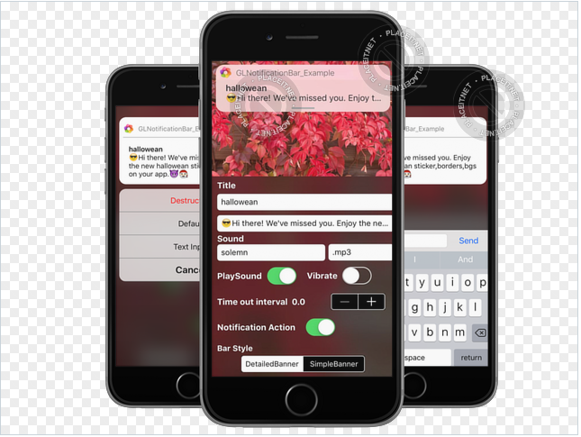
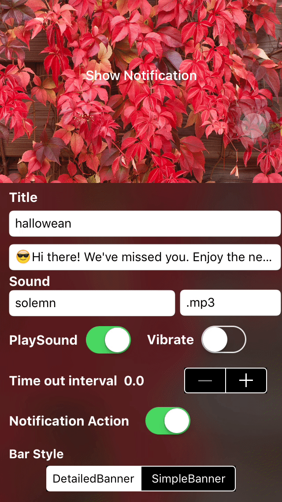

# GLNotificationBar

[](https://travis-ci.org/gokulgovind/GLNotificationBar)
[](http://cocoapods.org/pods/GLNotificationBar)
[](http://cocoapods.org/pods/GLNotificationBar)
[](http://cocoapods.org/pods/GLNotificationBar)

**FYI:** Updated with **swift 3.0**. For Swift 2 use tag 1.3.3



## Note

 `GLNotificationBar` is a library that allows you to easily create banner notifications that appear on top of screen, used to handle push notification in active state.Made with `xcode 8.3.1` and `swift 3`

## Example

 To run the example project, clone the repo, and run `pod install` from the Example directory first.

   
## Requirements
 `GLNotificationBar` requires iOS 8.0+.

## Installation

### CocoaPods

GLNotificationBar is available through [CocoaPods](http://cocoapods.org). To install
it, simply add the following line to your Podfile:

`pod 'GLNotificationBar'`

### Manual
Copy the file `GLNotificationBar.swift` & `GLNotificationBar.xib` from ~/GLNotificationBar/GLNotificationBar/Classes to your project.

## User Guide

### Swift:
  ```
  let notificationBar = GLNotificationBar(title: "Today Quote", message: "Yesterday is today's memory, and tomorrow is today's dream.", preferredStyle: .DetailedBanner, handler: nil)
  notificationBar.addAction(GLNotifyAction(title: "Like", style: .Default, handler: { (action) in
     print("I Like this quote")
  }))
  notificationBar.addAction(GLNotifyAction(title: "Cancel", style: .Cancel, handler: nil))
  ```
### Objective C:
  - Run pod install. `pod 'GLNotificationBar'`
  - Then add ```@import GLNotificationBar;``` at top of your viewcontroller class.
  - Now add following code wherever you want. 
    ```
    GLNotificationBar * notificationBar = [[GLNotificationBar alloc]initWithTitle:@"Today Quote" message:@"Yesterday is today's memory, and tomorrow is today's dream." preferredStyle:0 handler:nil];
    [notificationBar addAction:[[GLNotifyAction alloc]initWithTitle:@"Like" style:0 handler:^(GLNotifyAction * action) {
        NSLog(@"I Like this quote");
        //NSLog(@"Text reply %@",action.textResponse);
    }]];
    [notificationBar addAction:[[GLNotifyAction alloc]initWithTitle:@"Cancel" style:4 handler:nil]];
    ```


### Diving In Depth
- `GLNotificationBar` is simple to use,implementation is similar to `UIAlertController`.

   ```
   let notificationBar = GLNotificationBar(title: "hallowean", message: "😎Hi there! We've missed you. Enjoy the new hallowean sticker,borders,bgs on your app.😈🎅🏻", preferredStyle: .DetailedBanner, handler: nil)

   ```

   This simply presents GLNotificationBar with given title and message,handler can be used to catch tap gesture on notification bar. The default behavior of notification bar is, dismissed automatically when tapped on it.

There are two types of `GLNotificationBar` style and Five type of `GLNotifyAction` types.

- .DetailedBanner
   * *.DetailedBanner* style is similar to ios10 style notification bar, swiping down this type of notification open's in detail, which may include `GLNotifyAction's`
   `GLNotifyAction` can be added to `GLNotificationBar` as follows
   
     ```
     let cancelButton = GLNotifyAction(title: "Cancel", style: .Cancel) { (result) in
           print(result.actionTitle)
        }
        notificationBar.addAction(cancelButton)
      ```

      **OR**
      ```
      notificationBar.addAction(GLNotifyAction(title: "Cancel", style: .Cancel) { (result) in
          print(result.actionTitle)
      })
     ```
   * *GLNotifyAction* also has four different types each performs their respective action.
     
     ```
     public enum GLNotificationActionType {
        case Default  // Apply the default style to the action’s button.
        case Destructive  //Apply a style that indicates the action might change or delete data.
        case TextInput  //Apply a style that indicates the action opens an textinput field helps to respond notification as string.
        case OnlyTextInput  //Apply a style which removes all other action added and simply adds text field as input to respond notification.
        case Cancel  //Apply a style that indicates the action cancels the operation and leaves things unchanged.
     }
     ```    

   

- .SimpleBanner
   * *.SimpleBanner* is similar to *.DetailedBanner* in appearance, but it's options are restricted. It can't be swiped down to open in detail form.
   * `GLNotifyAction` added to this type of notification bar will not be taken into account.
   
   

- `GLNotifyAction`'s *.OnlyTextInput*
   ``` 
    notificationBar.addAction(GLNotifyAction(title: "Reply", style: .OnlyTextInput) { (result) in
         print(result.textResponse)
      })
   ```
   * *.OnlyTextInput* is some what different from other action types.
   * Adding this action removes all other action added and stight away presents textfield as option for user input without any user interaction. 
   * This helps user to repond to a notification with text.

  

- `notificationBar.showTime`
   ```
    notificationBar.showTime(3.0)
   ```
   * This method helps to set time interval for notification bar to hide.
   * The default value is 5.0 seconds.
   * And 0.0 can used to turn off auto hide of notification bar.


- `notificationBar.notificationSound`
   ```
    notificationBar.notificationSound("Your sound name", ofType: ".mp3", vibrate: true)
   ```
   * By default `GLNotificationBar` does't play any sound, to play notification sound add this method.
   * This method helps to play notification sound when it is displayed.
   * If mentioned sound file is not found means system default sound will be played.

## Author

gokul, gokulece26@gmail.com

## Social

  * [Facebook](https://www.facebook.com/gokul.rockzz.1)
  * [Twitter](https://twitter.com/gokulgovind_)
  * [StackOverflow](http://stackoverflow.com/users/5582022/gokul?tab=profile)
  * [Linkedin](https://www.linkedin.com/in/gokul-govind-1b0232105?trk=nav_responsive_tab_profile)

## License

GLNotificationBar is available under the MIT license. See the LICENSE file for more info.
